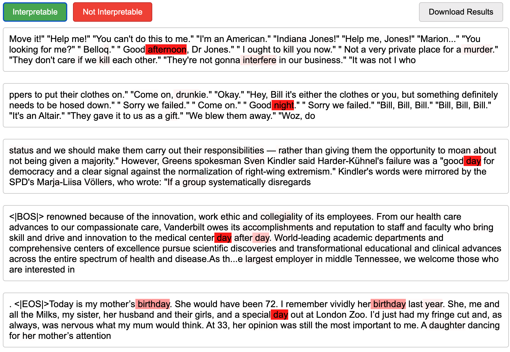

# NeuronLabel
Neuron Label is a simple tool for visually analyzing and labeling the interpretability of neurons in a neural network. The tool displays text snippets with activated tokens highlighted in varying shades of red based on their activation values. Users can label neurons as "Interpretable" or "Not Interpretable" and download the results in a JSON format.

<!-- image of screenshot -->


## Additional functionality

`neuronlabel/get_top.py` is a script that can be used to generate the data.json file from a trained model.

`neuronlabel/ask_gpt.py` can be used to automate the labeling process using GPT-3.


## Setup
1. Clone the repo.
2. Ensure you have a properly formatted data.json file.

## Usage
1. Run with `python serve.py /path/to/data.json`
2. Go to http://localhost:8000

## Data Format
The data.json file should have the following format:

```json
[
  {
    "neuron_id": "0",
    "snippets": [
      {
        "text": "example text 1",
        "max_activation": 0.95,
        "token_activation_pairs": [
          ["tok1", 0.2],
          ["tok2", 0.95],
          ...
        ]
      },
      ...
      ]
  },
  ...
]
```

`neuron_id` is the identifier of the neuron, and each `neuron_id` has an array of text snippets associated with it. Each text snippet object contains the following properties:

- `text`: The text snippet itself.
- `max_activation`: The maximum activation value of the neuron for this snippet.
- `token_activation_pairs`: An array of pairs, where each pair consists of a token and its corresponding activation value.

